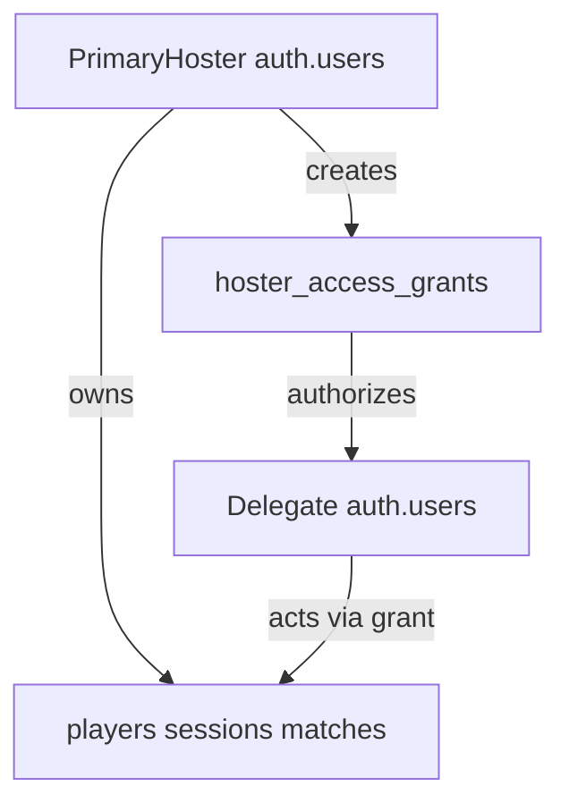
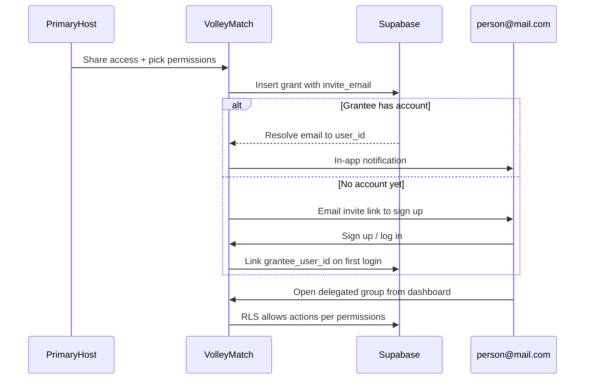

# Host Access Sharing

Implementation plan for grant-based host delegation — temporary substitute access and persistent co-host access with configurable permission checkboxes.

## Implementation checklist

- [ ] Add `hoster_access_grants` table, `can_act_on_hoster()` SQL helper, and update RLS policies
- [ ] Create `hoster-access` lib (permission presets/constants) and `hoster-access.service.ts`
- [ ] Add `host-delegation` feature slice with create/revoke/accept grant server actions
- [ ] Implement host context switcher (cookie + layout switcher + smart login prompt + substitute-mode visuals)
- [ ] Add permission checks to session, live-session, roster, and attendance actions
- [ ] Compare-and-set score RPC, host-side Realtime subscription, coach presence, conflict guards
- [ ] Build Share Access UI with email input, permission checkboxes, presets, and active grants list
- [ ] Build delegate dashboard cards and accept-invite flow
- [ ] Add en/pt locale keys, unit tests, integration tests for grant allow/deny paths

---

## Problem

Today VolleyMatch is **single-owner**: every row is scoped to `hoster_id`, and RLS enforces `auth.uid() = hoster_id`. There is no way for another authenticated user to run a session when the primary hoster is absent.

The design uses **invite by email with permission checkboxes** — one flexible grant model that covers both "can't make it today" and "we always co-run the group."

---

## Recommended Model: Permission Grants (not role renames)

Keep `hoster_id` as the **permanent data owner** on `players`, `sessions`, `matches`, and `mmr_history`. Do **not** transfer ownership for temporary handoffs. Instead, add grants that let another auth user act on the owner's namespace with explicit permissions.



This preserves history semantics (MMR, summaries, share cards stay under the original hoster) and avoids cascading `hoster_id` updates.

---

## Permission Flags (checkboxes in UI)

Define a fixed set of capabilities. The UI shows individual toggles **plus** presets.

| Permission key | What it allows | Typical temp use |
|---|---|---|
| `attendance` | Mark present, toggle session position chips | Pre-practice setup |
| `roster_add` | Add new players to global roster | Late arrivals not yet in roster |
| `roster_manage` | Edit/delete players, change MMR tier & positions | Full roster control |
| `session_start` | Set house rules, generate PIN, start session | Host absent before games |
| `session_live` | Matchmaking, scoreboard, substitutions, cancel/finish matches | Core "run the court" |
| `session_end` | End game day, trigger summary | Close out practice |
| `history_view` | View past sessions, leaderboard, summaries | Backup host reviewing stats |

**UI presets** (one-click, then user can tweak):

- **Complete control** — all flags on
- **Run today's session** — `attendance`, `session_start`, `session_live`, `session_end`, `roster_add`
- **Scorekeeper only** — `session_live` only
- **Custom** — manual checkboxes

Server-side: store as `permissions TEXT[]` (or `JSONB`) on the grant row; never trust client presets alone.

**Guardrails the owner always keeps** (not grantable):

- Revoke any grant
- Delete the hoster's account / billing (future)
- Grant access to others (optional: add `can_delegate` flag later; default off for temp grants)

---

## Database Schema

New migration in `supabase/migrations/` + sync `supabase/schema.sql`:

```sql
CREATE TABLE public.hoster_access_grants (
  id                UUID PRIMARY KEY DEFAULT gen_random_uuid(),
  owner_hoster_id   UUID NOT NULL REFERENCES auth.users(id) ON DELETE CASCADE,
  grantee_user_id   UUID REFERENCES auth.users(id) ON DELETE CASCADE,
  invite_email      TEXT,  -- used when grantee has no account yet
  permissions       TEXT[] NOT NULL DEFAULT '{}',
  scope             TEXT NOT NULL DEFAULT 'persistent'
                    CHECK (scope IN ('session', 'persistent')),
  session_id        UUID REFERENCES public.sessions(id) ON DELETE CASCADE,
  expires_at        TIMESTAMPTZ,
  revoked_at        TIMESTAMPTZ,
  granted_by        UUID NOT NULL REFERENCES auth.users(id),
  created_at        TIMESTAMPTZ NOT NULL DEFAULT now(),
  CONSTRAINT grantee_or_email CHECK (
    grantee_user_id IS NOT NULL OR invite_email IS NOT NULL
  )
);
```

**Scope rules:**

| Type | `scope` | `session_id` | `expires_at` |
|---|---|---|---|
| **Temporary** | `session` | Set when session exists; nullable until session starts | Required (e.g. end of day + 24h buffer) |
| **Full-time** | `persistent` | `NULL` | `NULL` |

Indexes: `(owner_hoster_id)`, `(grantee_user_id)`, `(invite_email)`, partial index on active grants where `revoked_at IS NULL`.

**RLS helper** (central authorization primitive):

```sql
-- can_act_on_hoster(owner_id, required_permission, session_id?)
CREATE OR REPLACE FUNCTION public.can_act_on_hoster(
  target_hoster_id UUID,
  required_permission TEXT,
  target_session_id UUID DEFAULT NULL
) RETURNS BOOLEAN ...
```

Logic: allow if `auth.uid() = target_hoster_id`, OR an active grant exists where:
- `owner_hoster_id = target_hoster_id`
- `grantee_user_id = auth.uid()`
- `required_permission = ANY(permissions)`
- `revoked_at IS NULL` AND (`expires_at IS NULL OR expires_at > now()`)
- For `scope = 'session'`: `session_id IS NULL OR session_id = target_session_id`

Then replace host-owned RLS policies from `USING (auth.uid() = hoster_id)` to `USING (public.can_act_on_hoster(hoster_id, '<permission>', <session_id if applicable>))`.

Tables and required permission mapping:

- `players` — `roster_add` (INSERT), `roster_manage` (UPDATE/DELETE), `attendance` for present flags
- `sessions` — `session_start` (INSERT), `session_live`/`session_end` (UPDATE), `history_view` (SELECT for ended sessions)
- `matches` / `match_events` — `session_live`
- `session_players` — `attendance` + `session_live`
- `mmr_history` — `history_view` (SELECT), written only by session lifecycle actions

Owner retains full access via the `auth.uid() = hoster_id` branch inside the helper.

---

## Invite Flow (email-based)



**Implementation notes:**

- **Email lookup**: Supabase Admin API to resolve `invite_email` → `user_id` at grant creation. If not found, store pending grant with `invite_email` only.
- **Pending grant activation**: On login, link grants where `invite_email = user.email AND grantee_user_id IS NULL`.
- **Invite link**: `/dashboard/delegation/accept?grant=<id>` — confirms intent after auth.

---

## App Layer Changes

### Authorization helper in `lib/`

- `src/lib/auth/hoster-access.ts` — permission constants, presets, `hasPermission()`
- `src/lib/services/hoster-access.service.ts` — CRUD, pending invite linking, `getEffectivePermissions()`

### Server actions — `src/features/host-delegation/`

- `createAccessGrant`, `revokeAccessGrant`, `acceptPendingGrant`, `updateGrantPermissions`

### Host context switcher (critical UX)

Maria has her **own** hoster account *and* a temp grant to run **your** practice today. Use a **context switcher** (Slack-workspace pattern) plus a **smart prompt** only when substitution is relevant — not a mandatory host picker on every login.

**Layer 1 — Default context:** After login, land in **"My group"** (`effectiveHosterId = user.id`).

**Layer 2 — Header switcher:** `[My group ▼]` → Fabio's group (Substitute · expires tonight). Stored in httpOnly cookie `vm_host_context`.

**Layer 3 — Smart login prompt:** Show when user has active temp grant expiring within 24h and no active session in own group. Invite deep links skip prompt and land directly in substitute context.

**Substitute mode visuals:** Amber banner, "Fabio's players" labels, permission summary, hidden share-access settings.

### Touch points in existing features

| Area | Change |
|---|---|
| `src/features/session/actions.ts` | Check `session_start` permission |
| `src/features/live-session/actions.ts` | Check `session_live` |
| `src/features/live-session/team-actions.ts` | Check `session_live` |
| `src/features/roster/actions.ts` | Check `roster_add` / `roster_manage` |
| `src/features/roster/attendance-actions.ts` | Check `attendance` |
| `src/app/dashboard/layout.tsx` | Load delegated groups, context switcher, substitute banner |

---

## Multi-Coach Concurrency

When multiple grantees manage the same session, **PostgreSQL remains the single source of truth**.

### Scoring: deduplicated transitions (compare-and-set)

Two coaches tapping the same point should **not** double-count. Both screens show **6**, but the DB makes **one** transition 5 → 6. Only that single DB change triggers the spectator **"Who scored?"** prompt.

```sql
UPDATE matches
SET team_a_score = GREATEST(0, team_a_score + $delta_a),
    team_b_score = GREATEST(0, team_b_score + $delta_b),
    updated_at = now()
WHERE id = $match_id
  AND team_a_score = $expected_a
  AND team_b_score = $expected_b
RETURNING *;
-- 0 rows → no-op; no match_event; no duplicate prompt
```

**Fabio + Maria both tap Red +1 from 5:**

| Step | Fabio | Maria | DB | Who scored prompt |
|---|---|---|---|---|
| Both tap | UI → 6 | UI → 6 | 5 → 6 once | One prompt for state `6-x` |

Server action returns `{ applied: true }` or `{ applied: false, scoreA, scoreB }`. `match_events` inserted only when `applied: true`.

### Other tiers

- **Tier 2 (attendance, roster add):** Last-write-wins + Realtime sync
- **Tier 3 (generate/finish/end session):** Idempotency + version check + friendly refresh toast
- **Coach presence:** Supabase Presence on live page for awareness and end-session confirm

Add `src/features/live-session/useLiveSessionSync.ts` — host Realtime subscription on matches/sessions/session_players.

---

## Phased Delivery

### Phase 1 — Foundation (temp handoffs)

- Migration + RLS + grants table
- Host-delegation feature + email invites
- Context switcher + substitute visuals
- Share access UI with checkboxes + presets
- Permission checks in existing actions
- Compare-and-set score RPC + `useLiveSessionSync`
- i18n (en + pt)

### Phase 2 — Full-time co-hosts

- Persistent grant UI, delegate dashboard, history_view wiring
- Coach presence + end-session confirm

### Phase 3 — Polish

- Audit log, optional `can_delegate`, align with roadmap "shared group leaderboard" tier

---

## Risks and Mitigations

| Risk | Mitigation |
|---|---|
| RLS policy drift | Single SQL helper function |
| Delegate acts on wrong group | Context switcher + substitute banner + permission checks |
| Two coaches double-score same point | Expected-score guard; one match_event, one Who scored prompt |
| Two coaches generate match simultaneously | Guard + toast + refresh |
| Email not yet registered | Pending grant with `invite_email`; activate on signup |
