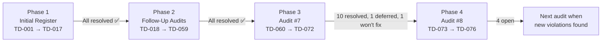

# VolleyMatch — Tech Debt Register

**Last audited:** 2026-07-08  
**Audited against:** `AGENTS.md` architecture guide  
**Current phase:** Phase 4 — Audit #8 (TD-073 → TD-076 open)

> Items are scored **P1 (blocking/risky)**, **P2 (significant)**, or **P3 (minor/cosmetic)**.  
> Detailed implementation notes live in [`docs/implementation/tech-debts/`](implementation/tech-debts/).

---

## Current Status Snapshot

| Metric | Value |
|---|---|
| Total TD items tracked | **76** (TD-001 → TD-076) |
| Fully resolved | **70** |
| Deferred | **1** (TD-067) |
| Won't Fix (documented exception) | **1** (TD-072, inherits TD-030) |
| Open | **4** (TD-073 → TD-076) |
| Files over any hard limit | **0** (excluding generated `database.ts`) |
| `any` type instances | **0** |
| `supabase.from()` outside `lib/services/` | **0** (+ OG route documented exception) |
| Cross-feature imports | **0** |
| Files importing >10 modules | **0** |

---

## How This Register Evolved

The tech-debt program runs in phases. Each phase ends with a fresh codebase audit against
`AGENTS.md`; newly discovered violations receive sequential TD IDs and a follow-up document in
`docs/implementation/tech-debts/`.

### Phase 1 — Initial Register (2026-07-07)

**Scope:** First full audit of the Next.js migration codebase.  
**Items:** TD-001 → TD-017  
**Status:** All resolved ✅

The original register captured the highest-impact violations found at migration time: god
components (`Scoreboard.tsx` at 602 lines), god action files, `any` types across 13 files, raw
Supabase calls in pages, spectator/summary UI in `app/`, cross-feature imports, and missing
barrels.

| ID | Priority | Category | Original issue | Resolution |
|---|---|---|---|---|
| TD-001 | P1 | File size | `Scoreboard.tsx` — 602 lines | Decomposed → 177-line orchestrator + 8 sub-components |
| TD-002 | P1 | File size | `live-session/actions.ts` — 406 lines | Split → `actions.ts` (93 lines) + `_draft.ts` (126 lines) |
| TD-003 | P1 | File size | `lib/stats/summaryStats.ts` — 473 lines | Split → `session-stats`, `dashboard-stats`, `stat-helpers`, barrel |
| TD-004 | P1 | File size | `lib/matchmaking/index.ts` — 342 lines | Split → `types`, `draft`, `strict-draft`, `rotation`, barrel |
| TD-005 | P2 | File size | `app/dashboard/page.tsx` — 211 lines | Extracted `features/dashboard/` → page 48 lines |
| TD-006 | P2 | File size | `app/dashboard/session/page.tsx` — 238 lines | Extracted session components → page 91 lines |
| TD-007 | P2 | File size | `app/dashboard/roster/page.tsx` — 190 lines | Extracted roster components → page 54 lines |
| TD-008 | P1 | TypeScript | `any` in 13 files | Zero `any` repo-wide |
| TD-009 | P2 | Architecture | Raw Supabase in summary page | `storeSummaryData()` in `lib/services/` |
| TD-010 | P2 | Architecture | Raw Supabase in session/roster pages | All pages delegate to `lib/services/` |
| TD-011 | P2 | Architecture | Spectator components in `app/view/` | Moved to `features/spectator/` slice |
| TD-012 | P2 | Architecture | `HighlightsGrid.tsx` in `app/` | Moved to `features/summary/` |
| TD-013 | P3 | Structure | `lib/stats/` missing barrel | `lib/stats/index.ts` created |
| TD-014 | P2 | i18n | Hardcoded `"Swap Sides"` | `t('swapSides')` in `AdminControls` |
| TD-015 | P1 | Architecture | Cross-feature `live-session` → `session` | `onEndSession` callback prop |
| TD-016 | P3 | Architecture | Inline `signOut` in dashboard page | Extracted to `features/dashboard/actions.ts` |
| TD-017 | P3 | Structure | Incomplete `session/index.ts` barrel | Exports actions + 3 components |

**Implementation docs:** [`01`](implementation/tech-debts/01-TD015-cross-feature-import.md) – [`11`](implementation/tech-debts/11-TD014-TD016-polish.md)

---

### Phase 2 — Follow-Up Audits (2026-07-08)

**Scope:** Seven post-implementation audits; each pass fixed the prior batch then re-scanned the
codebase for violations missed or introduced by remediation work.  
**Items:** TD-018 → TD-059  
**Status:** All resolved ✅

| Audit | Doc | TD range | Theme | Items |
|---|---|---|---|---|
| #1 | [`12-TD018-TD024`](implementation/tech-debts/12-TD018-TD024-follow-up-gaps.md) | 018–024 | Residual god files, cross-layer imports, page Supabase | 7 |
| #2 | [`13-TD025-TD031`](implementation/tech-debts/13-TD025-TD031-follow-up-gaps-2.md) | 025–031 | Roster action split, Database types stub, deep imports, OG i18n | 7 |
| #3 | [`14-TD032-TD033`](implementation/tech-debts/14-TD032-TD033-follow-up-gaps-3.md) | 032–033 | Remaining page/route Supabase, position `as any` casts | 2 |
| #4 | [`15-TD034-TD041`](implementation/tech-debts/15-TD034-TD041-follow-up-gaps-4.md) | 034–041 | Feature-action Supabase, typed clients, join flow relocation, page sizes | 8 |
| #5 | [`16-TD042-TD050`](implementation/tech-debts/16-TD042-TD050-follow-up-gaps-5.md) | 042–050 | Spectator hook, service return types, HighlightsGrid, metadata i18n | 9 |
| #6 | [`17-TD043-TD059`](implementation/tech-debts/17-TD043-TD059-follow-up-gaps-6.md) | 043–059 | Residual casts, ActionError, QrCodeModal, live page assembly, barrels | 17 |
| — | [`01`–`11` impl docs](implementation/tech-debts/) | (Phase 1) | Targeted implementation guides for TD-001–017 | — |

**Key outcomes from Phase 2:**

- **`lib/services/`** is the sole Supabase access layer (feature actions, pages, and routes cleaned up; TD-034)
- **`Database` generic** wired through all client factories and services (TD-035)
- **`features/public-join/`**, **`features/spectator/`**, **`features/dashboard/`** slices fully established
- **`ActionError` + `assertAuthenticated()`** replace hardcoded auth throws (TD-044)
- **`parsePlayerPosition`** at service boundary; UI `as PlayerPosition` casts removed (TD-041)
- **`getSpectatorViewData()` / `getLiveSessionViewData()`** extract page assembly logic (TD-048, TD-053)
- **Root layout metadata** localized via `generateMetadata()` (TD-050)

**Won't Fix carried forward:** TD-030 (OG image route Edge/i18n constraint) → TD-072

---

### Phase 3 — Audit #7 (2026-07-08)

**Scope:** Fresh cross-check after TD-043 → TD-059 closed.  
**Items:** TD-060 → TD-072  
**Status:** 10 resolved ✅ · 1 deferred (TD-067) · 1 won't fix (TD-072)  
**Full detail:** [`18-TD060-TD072-follow-up-gaps-7.md`](implementation/tech-debts/18-TD060-TD072-follow-up-gaps-7.md)

**Key outcomes from Phase 3:**

- **Landing, login, share pages** localized (`Home`, `Login`, `Metadata` namespaces; TD-060, TD-061, TD-068)
- **`ActiveSessionBanner`** routes through `getActiveSession()` service (TD-063)
- **Auth guards** added to `updateScore`, `cancelMatch`, `substitutePlayer` (TD-064)
- **`getActionErrorMessage()`** helper created; wired in `PlayerJoinForm` (TD-065)
- **`HighlightDetailModal`** decomposed into 4 variant panels — **157 lines** (TD-066)
- **`parsePositionRecord()`** in mappers; used in team actions and draft logic (TD-070)
- **Generated `database.ts`** file-size exception documented in `AGENTS.md` §4.1 (TD-071)

---

### Phase 4 — Audit #8 (2026-07-08)

**Scope:** Verification pass after TD-060 → TD-071 remediation landed in the working tree.  
**Items:** TD-073 → TD-076  
**Status:** 4 open  
**Full detail:** [`19-TD073-TD076-follow-up-gaps-8.md`](implementation/tech-debts/19-TD073-TD076-follow-up-gaps-8.md)

---

## Open Items

### TD-073 · Residual Intra-Feature Deep Imports · P3

| | |
|---|---|
| **Rule** | AGENTS §3.2 |
| **Files** | `Scoreboard.tsx`, `SpectatorScoreboard.tsx`, `AttendanceToggle.tsx`, `AttendanceControls.tsx` |

TD-059 closed all `../actions` imports ✅. Four components still use `../hooks` or
`../attendance-actions` instead of the feature barrel.

**Remediation:** Export hooks from feature barrels; update roster components to import from
`@/features/roster`.

---

### TD-074 · live-session/hooks.ts Exceeds Soft Limit · P3

| | |
|---|---|
| **File** | `src/features/live-session/hooks.ts` |
| **Size** | 220 lines (soft limit: 200) |
| **Rule** | AGENTS §4.1 |

**Remediation:** Split `useScoreboard` into timer, vote-toast, and action sub-hooks when next
touched for live-session work.

---

### TD-075 · Dashboard Pages Marginally Over Page Soft Limit · P3

| | |
|---|---|
| **Rule** | AGENTS §4.1 |
| **Files** | `history/page.tsx` (102), `leaderboard/page.tsx` (107), `summary/[session_id]/page.tsx` (101) |

All three are localized and use `lib/services/` ✅ — violation is structural only.

**Remediation:** Extract `HistoryMatchCard`, `LeaderboardTable`, and `SummaryPageHeader` into
feature components.

---

### TD-076 · Matchmaker Swallows Action Errors · P3

| | |
|---|---|
| **File** | `src/features/live-session/components/Matchmaker.tsx` L27–28 |
| **Rule** | AGENTS §6 — TD-065 residual |

`generateMatch` / `saveMatch` errors are caught and `console.error`'d with no user-facing
feedback despite `getActionErrorMessage()` existing.

**Remediation:** Add error state + `getActionErrorMessage()` in the Matchmaker draft panel.

---

## Deferred / Won't Fix

### TD-067 · lib/mmr/index.ts Approaching Soft Limit · P3

| | |
|---|---|
| **File** | `src/lib/mmr/index.ts` |
| **Size** | 239 lines (soft limit: 250) |
| **Status** | **Deferred** — split when next touched for MMR work |

Split into `calculation.ts`, `setter-bonus.ts`, `types.ts`, barrel when MMR features are next
modified.

---

### TD-072 · OG Image Route — Won't Fix · P3

| | |
|---|---|
| **File** | `src/app/api/og/summary/route.tsx` |
| **Status** | **Won't Fix** (inherits TD-030) |

Direct Supabase call and hardcoded English accepted due to Edge-runtime / i18n constraints.
Inline comment in route file documents the exception.

---

## Open Items Summary

| ID | Priority | Category | File(s) | Status |
|---|---|---|---|---|
| TD-073 | P3 | Structure | Residual `../hooks` / `../attendance-actions` imports | **Open** |
| TD-074 | P3 | File size | `live-session/hooks.ts` — 220 lines | **Open** |
| TD-075 | P3 | File size | History, leaderboard, summary session pages | **Open** |
| TD-076 | P3 | i18n | Matchmaker swallows ActionError | **Open** |
| TD-067 | P3 | File size | `lib/mmr/index.ts` | Deferred |
| TD-072 | P3 | Architecture | OG route | Won't Fix |

All other items (TD-001 → TD-066, TD-068 → TD-071) are resolved ✅

---

## Suggested Next Step

Wire user-facing error feedback in `Matchmaker` (TD-076) — quick win that completes TD-065
adoption. Then route remaining intra-feature imports through barrels (TD-073).

---

## Document Index

All implementation and audit documents live in [`docs/implementation/tech-debts/`](implementation/tech-debts/):

| Doc | Covers |
|---|---|
| `01`–`11` | Phase 1 implementation guides (TD-001–017) |
| `12` | Audit #1 — TD-018–024 |
| `13` | Audit #2 — TD-025–031 |
| `14` | Audit #3 — TD-032–033 |
| `15` | Audit #4 — TD-034–041 |
| `16` | Audit #5 — TD-042–050 |
| `17` | Audit #6 — TD-043–059 |
| `18` | Audit #7 — TD-060–072 |
| `19` | Audit #8 — TD-073–076 **(current)** |
